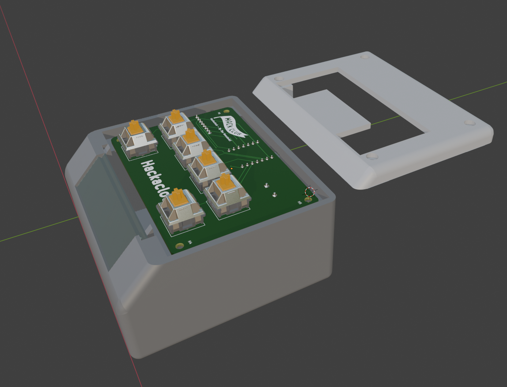
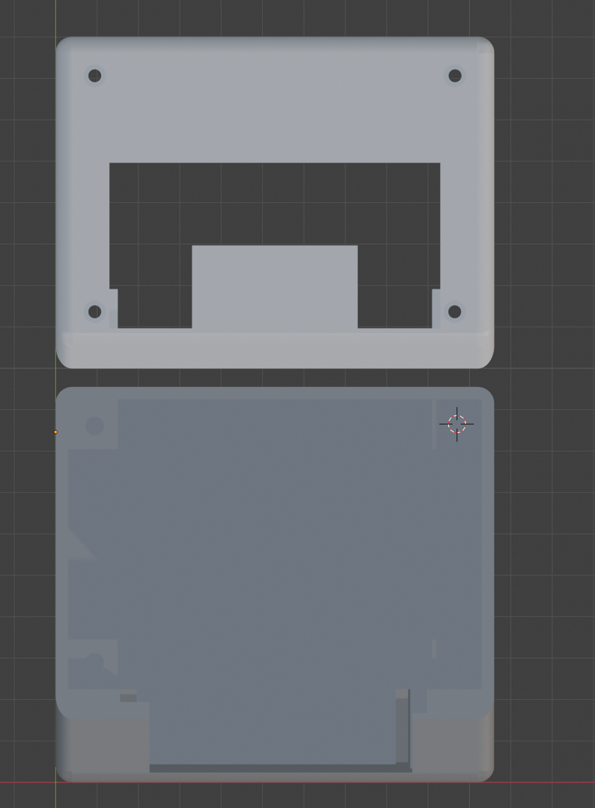
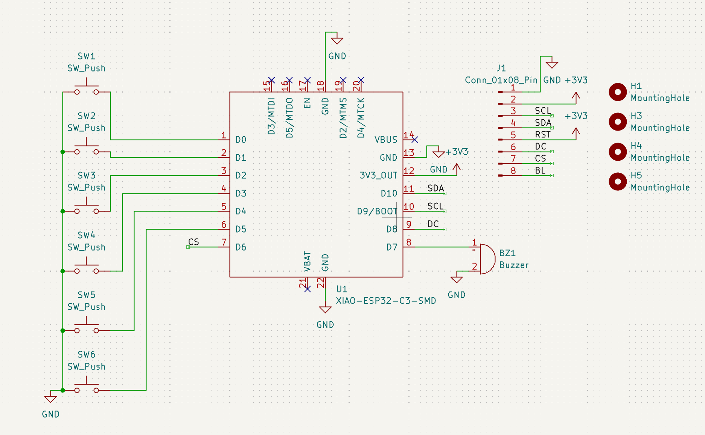
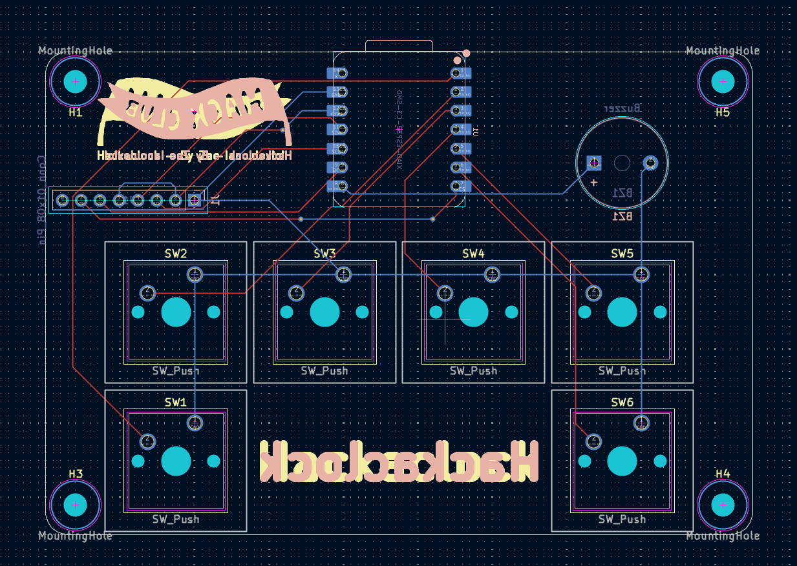

# hackaclock
My Stardance BLARE alarm clock!!!

## Challenges
I ran into some pretty tough issues while doing CAD. I made a dumb decision at the start to use blender for my CAD even though it's not exactly a CAD program. Loads of non-manifold errors and geometry issues (that might just be why my commit history looks terrible). I spent over 13 hours just getting the CAD done! Despite these problems, I am still very happy with the result and the CAD (in my humble opinion) looks great.

## Files
* [Firmware: hackaclock.ino](firmware/hackaclock.ino)
* [Box: Hackaclock-Box.stl](Production/Hackaclock-Box.stl)
* [Lid: Hackaclock-Lid.stl](Production/Hackaclock-Lid.stl)
* [PCB: Board.step](Production/Board.step)
* [Gerbers: fab_files.zip](Production/fab_files.zip)

## Specs
### BOM
* 6x Cherry MX Switches
* 6x Blank Keycaps
* 1x Unimportant jumper header
* 1x XIAO ESP32-C3
* 4x M3x16 bolts
* 4x M3 heat-set inserts
* 1x Buzzer

### Firmware
I am using the most barebones firmware to begin, but I will make it super cool after I build. Currently it only gets the local time via WiFi with no fallback, but I will eventually add:
* Alarms
* Manual time setting
* Timer/stopwatch
* Alarm snooze
* Buzzer goes beeeeeeep
* More features...

### CAD
The CAD is a very simple (13h worth of simple) box and lid with a slot for the display and supports for the PCB.

## PCB:
Here is the Schematic and PCB layout for hackaclock.

---
<small>2026 - Zac Ianculovici | [Contact](mailto:zachary.ianculovici@gmail.com) | [Slack](https://hackclub.enterprise.slack.com/team/U0BMLT1CFB3)</small>
